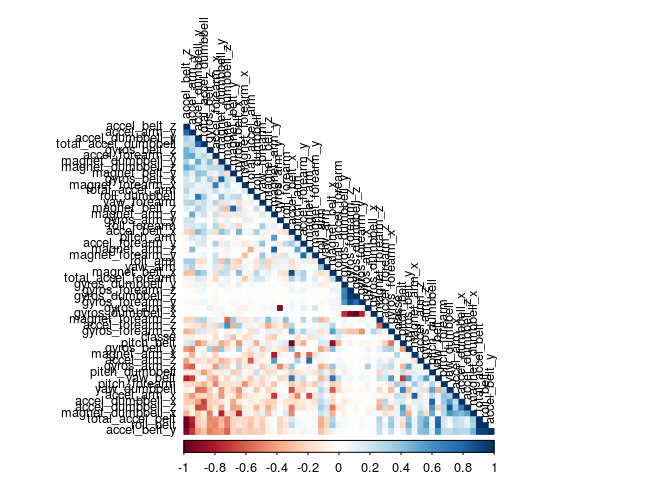
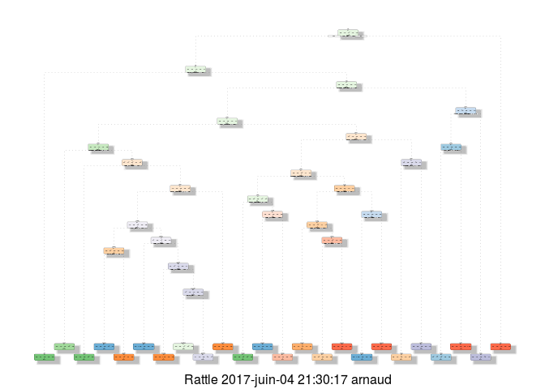

# Machine Learning - Prediction Assignment Writeup
Arnaud Legoubin  
June 4,2017  
# Executive Summary

Using devices such as Jawbone Up, Nike FuelBand, and Fitbit it is now possible to collect a large amount of data about personal activity relatively inexpensively. These type of devices are part of the quantified self movement - a group of enthusiasts who take measurements about themselves regularly to improve their health, to find patterns in their behavior, or because they are tech geeks. One thing that people regularly do is quantify how much of a particular activity they do, but they rarely quantify how well they do it. In this project, your goal will be to use data from accelerometers on the belt, forearm, arm, and dumbell of 6 participants. They were asked to perform barbell lifts correctly and incorrectly in 5 different ways. More information is available from the website here  [http://groupware.les.inf.puc-rio.br/har]http://groupware.les.inf.puc-rio.br/har (see the section on the Weight Lifting Exercise Dataset).

# Analysis

### Load libraries


```r
library(caret)
library(corrplot)
library(rpart)
library(rpart.plot)
library(rattle)
```

### 1) Download the datasets


```r
setwd("~/R/local_workdir/M8/W4")

if (!file.exists("./pml-training.csv")) {
  url.training <- "https://d396qusza40orc.cloudfront.net/predmachlearn/pml-training.csv"
  download.file(url.training, destfile = "./data/pml-training.csv")
}

if (!file.exists("./pml-testing.csv")) {
  url.testing <- "https://d396qusza40orc.cloudfront.net/predmachlearn/pml-testing.csv"
  download.file(url.testing, destfile = "./data/pml-testing.csv")
}

training <- read.csv("./pml-training.csv")
testing <- read.csv("./pml-testing.csv")
```


### 2) Load the data


```r
training <- read.csv("./pml-training.csv")
testing <- read.csv("./pml-testing.csv")


dim(training)
```

```
## [1] 19622   160
```

```r
dim(testing)
```

```
## [1]  20 160
```


### 3) Prepare/Clean the data

As we have about 119 variables in the source dataset, we need to check whether we can remove some of theme that are unnecessary to the analysis.

We need to remove NA variables and 0 or close to 0 variance records that will only pollute the end results.


```r
training <- training[, colSums(is.na(training)) == 0] 
NearZeroVarIndex<-nearZeroVar(training)
training <- training[,-NearZeroVarIndex]
```

We can also remove non needed columns such as the timeastamps and label values


```r
training <- training[, -(1:5)]
testing <- testing[, -(1:5)]

dim(training)
```

```
## [1] 19622    54
```

This has allowed to significantly the number of predictors to analyze

### 4) Data Partitionning

Using the caret package, we can now split the training data set into two subsets. We will keep the provided testing set with 20 records only to apply the model we will have chosen. We will keep 30% of the training set to verify the accuracy of the selected method. We are going to test the random forest, the decision tree and the GBM methods.


```r
set.seed(657896) 
inTrain <- createDataPartition(training$classe, p=0.70, list=F)
train_data <- training[inTrain, ]
test_data <- training[-inTrain, ]
```

### 5) Correlation Matrix

Let's use a correlation plot to indentify whether to variables are strongly correlated to each other. This may help to further reduce the number of variables.


```r
cor_train_data<-train_data[, -c(1,88)]
cor_train_data<-sapply(cor_train_data,as.numeric)
corMatrix <- cor(cor_train_data)
```

See Appendix 1.

We can see there are some correlated variables but they don't seem to represent a high number of the current predictors. As such it may not be necessary to remove them at this point.

### 6) RF Model

Let's fit a random forest method.


```r
set.seed(8877)
ctrl_rf <- trainControl(method="cv", number=3, verboseIter=FALSE)
mod_fit_rf <- train(classe ~ ., data=train_data, method="rf",
                          trControl=ctrl_rf)
```

```
## Loading required package: randomForest
```

```
## randomForest 4.6-12
```

```
## Type rfNews() to see new features/changes/bug fixes.
```

```
## 
## Attaching package: 'randomForest'
```

```
## The following object is masked from 'package:ggplot2':
## 
##     margin
```

```r
mod_fit_rf$finalModel
```

```
## 
## Call:
##  randomForest(x = x, y = y, mtry = param$mtry) 
##                Type of random forest: classification
##                      Number of trees: 500
## No. of variables tried at each split: 27
## 
##         OOB estimate of  error rate: 0.27%
## Confusion matrix:
##      A    B    C    D    E  class.error
## A 3904    2    0    0    0 0.0005120328
## B   11 2643    3    1    0 0.0056433409
## C    0    6 2390    0    0 0.0025041736
## D    0    0    8 2243    1 0.0039964476
## E    0    0    0    5 2520 0.0019801980
```

Now we do have the model. We can use the 30% testing subset to run a confusion matrix and test the accuracy.


```r
pred_rf <- predict(mod_fit_rf, newdata=test_data)
conf_mat_rf <- confusionMatrix(pred_rf, test_data$classe)
conf_mat_rf
```

```
## Confusion Matrix and Statistics
## 
##           Reference
## Prediction    A    B    C    D    E
##          A 1674    4    0    0    0
##          B    0 1133    4    0    2
##          C    0    2 1022    7    0
##          D    0    0    0  957    2
##          E    0    0    0    0 1078
## 
## Overall Statistics
##                                           
##                Accuracy : 0.9964          
##                  95% CI : (0.9946, 0.9978)
##     No Information Rate : 0.2845          
##     P-Value [Acc > NIR] : < 2.2e-16       
##                                           
##                   Kappa : 0.9955          
##  Mcnemar's Test P-Value : NA              
## 
## Statistics by Class:
## 
##                      Class: A Class: B Class: C Class: D Class: E
## Sensitivity            1.0000   0.9947   0.9961   0.9927   0.9963
## Specificity            0.9991   0.9987   0.9981   0.9996   1.0000
## Pos Pred Value         0.9976   0.9947   0.9913   0.9979   1.0000
## Neg Pred Value         1.0000   0.9987   0.9992   0.9986   0.9992
## Prevalence             0.2845   0.1935   0.1743   0.1638   0.1839
## Detection Rate         0.2845   0.1925   0.1737   0.1626   0.1832
## Detection Prevalence   0.2851   0.1935   0.1752   0.1630   0.1832
## Balanced Accuracy      0.9995   0.9967   0.9971   0.9962   0.9982
```

```r
overall.accuracy <- conf_mat_rf$overall['Accuracy']
```

We get an accuracy of **0.9964316**  with this model.


### 7) GBM Model

Likewise, we will fit a GBM model.


```r
set.seed(8877)
ctrl_gbm <- trainControl(method = "repeatedcv", number = 5, repeats = 1)
mod_fit_gbm <- train(classe ~ ., data=train_data, method = "gbm",
                    trControl = ctrl_gbm, verbose = FALSE)
```

```
## Loading required package: gbm
```

```
## Loading required package: survival
```

```
## 
## Attaching package: 'survival'
```

```
## The following object is masked from 'package:caret':
## 
##     cluster
```

```
## Loading required package: splines
```

```
## Loading required package: parallel
```

```
## Loaded gbm 2.1.3
```

```
## Loading required package: plyr
```

```r
mod_fit_gbm$finalModel
```

```
## A gradient boosted model with multinomial loss function.
## 150 iterations were performed.
## There were 53 predictors of which 43 had non-zero influence.
```


```r
pred_gbm <- predict(mod_fit_gbm, newdata=test_data)
conf_mat_gbm <- confusionMatrix(pred_gbm, test_data$classe)
conf_mat_gbm
```

```
## Confusion Matrix and Statistics
## 
##           Reference
## Prediction    A    B    C    D    E
##          A 1670   24    0    0    0
##          B    4 1103    4    4    9
##          C    0   11 1015    7    4
##          D    0    1    6  949    5
##          E    0    0    1    4 1064
## 
## Overall Statistics
##                                           
##                Accuracy : 0.9857          
##                  95% CI : (0.9824, 0.9886)
##     No Information Rate : 0.2845          
##     P-Value [Acc > NIR] : < 2.2e-16       
##                                           
##                   Kappa : 0.9819          
##  Mcnemar's Test P-Value : NA              
## 
## Statistics by Class:
## 
##                      Class: A Class: B Class: C Class: D Class: E
## Sensitivity            0.9976   0.9684   0.9893   0.9844   0.9834
## Specificity            0.9943   0.9956   0.9955   0.9976   0.9990
## Pos Pred Value         0.9858   0.9813   0.9788   0.9875   0.9953
## Neg Pred Value         0.9990   0.9924   0.9977   0.9970   0.9963
## Prevalence             0.2845   0.1935   0.1743   0.1638   0.1839
## Detection Rate         0.2838   0.1874   0.1725   0.1613   0.1808
## Detection Prevalence   0.2879   0.1910   0.1762   0.1633   0.1816
## Balanced Accuracy      0.9960   0.9820   0.9924   0.9910   0.9912
```

```r
overall.accuracy <- conf_mat_gbm$overall['Accuracy']
```

We get an accuracy of **0.9857264**  with this model.

### 8) Decision Tree Model


```r
set.seed(8877)
mod_fit_dt <-  rpart(classe ~ ., data=train_data, method="class")

mod_fit_dt
```

```
## n= 13737 
## 
## node), split, n, loss, yval, (yprob)
##       * denotes terminal node
## 
##    1) root 13737 9831 A (0.28 0.19 0.17 0.16 0.18)  
##      2) roll_belt< 130.5 12568 8670 A (0.31 0.21 0.19 0.18 0.11)  
##        4) pitch_forearm< -33.65 1124   10 A (0.99 0.0089 0 0 0) *
##        5) pitch_forearm>=-33.65 11444 8660 A (0.24 0.23 0.21 0.2 0.12)  
##         10) magnet_dumbbell_y< 432.5 9568 6859 A (0.28 0.18 0.24 0.19 0.11)  
##           20) roll_forearm< 120.5 5880 3447 A (0.41 0.18 0.19 0.16 0.059)  
##             40) magnet_dumbbell_z< -24.5 2019  623 A (0.69 0.19 0.018 0.07 0.032) *
##             41) magnet_dumbbell_z>=-24.5 3861 2804 C (0.27 0.17 0.27 0.21 0.074)  
##               82) num_window< 241.5 889  144 A (0.84 0.0011 0 0.067 0.093) *
##               83) num_window>=241.5 2972 1915 C (0.098 0.22 0.36 0.26 0.068)  
##                166) accel_dumbbell_y>=-40.5 2523 1782 D (0.12 0.26 0.25 0.29 0.08)  
##                  332) roll_belt>=125.5 612  247 C (0 0.37 0.6 0.028 0.0049)  
##                    664) pitch_belt< -42.65 238   17 B (0 0.93 0.0042 0.055 0.013) *
##                    665) pitch_belt>=-42.65 374   10 C (0 0.016 0.97 0.011 0) *
##                  333) roll_belt< 125.5 1911 1187 D (0.15 0.22 0.15 0.38 0.1)  
##                    666) num_window< 260 122    0 B (0 1 0 0 0) *
##                    667) num_window>=260 1789 1065 D (0.16 0.17 0.16 0.4 0.11)  
##                     1334) num_window< 278.5 109    0 C (0 0 1 0 0) *
##                     1335) num_window>=278.5 1680  956 D (0.17 0.18 0.1 0.43 0.12)  
##                       2670) pitch_belt< -42.45 369  226 A (0.39 0.36 0.17 0.07 0.016) *
##                       2671) pitch_belt>=-42.45 1311  613 D (0.11 0.13 0.082 0.53 0.15) *
##                167) accel_dumbbell_y< -40.5 449   35 C (0 0.04 0.92 0.038 0) *
##           21) roll_forearm>=120.5 3688 2470 C (0.075 0.18 0.33 0.24 0.18)  
##             42) accel_forearm_x>=-104.5 2615 1637 C (0.083 0.22 0.37 0.11 0.21)  
##               84) magnet_dumbbell_z>=286.5 645  458 A (0.29 0.27 0.019 0.17 0.25)  
##                168) accel_dumbbell_z< 28.5 218   43 A (0.8 0.083 0.046 0.069 0) *
##                169) accel_dumbbell_z>=28.5 427  263 E (0.028 0.36 0.0047 0.22 0.38)  
##                  338) num_window< 259.5 139   11 B (0.079 0.92 0 0 0) *
##                  339) num_window>=259.5 288  124 E (0.0035 0.094 0.0069 0.33 0.57) *
##               85) magnet_dumbbell_z< 286.5 1970 1004 C (0.015 0.2 0.49 0.096 0.19)  
##                170) num_window>=88.5 1707  741 C (0.011 0.16 0.57 0.11 0.15)  
##                  340) num_window< 479 1136  323 C (0.012 0.14 0.72 0.12 0.011) *
##                  341) num_window>=479 571  322 E (0.0088 0.19 0.27 0.096 0.44)  
##                    682) num_window>=781.5 313  160 C (0.016 0.35 0.49 0.086 0.061) *
##                    683) num_window< 781.5 258   28 E (0 0 0 0.11 0.89) *
##                171) num_window< 88.5 263  133 B (0.042 0.49 0 0 0.46)  
##                  342) num_window>=68.5 130    0 B (0 1 0 0 0) *
##                  343) num_window< 68.5 133   11 E (0.083 0 0 0 0.92) *
##             43) accel_forearm_x< -104.5 1073  501 D (0.055 0.081 0.22 0.53 0.11)  
##               86) magnet_arm_y>=291 340  143 C (0.035 0.13 0.58 0.19 0.074) *
##               87) magnet_arm_y< 291 733  224 D (0.064 0.06 0.059 0.69 0.12) *
##         11) magnet_dumbbell_y>=432.5 1876  933 B (0.04 0.5 0.045 0.22 0.19)  
##           22) total_accel_dumbbell>=5.5 1347  487 B (0.056 0.64 0.061 0.025 0.22)  
##             44) roll_belt>=-0.58 1146  286 B (0.065 0.75 0.072 0.03 0.083) *
##             45) roll_belt< -0.58 201    0 E (0 0 0 0 1) *
##           23) total_accel_dumbbell< 5.5 529  141 D (0 0.16 0.0038 0.73 0.11) *
##      3) roll_belt>=130.5 1169    8 E (0.0068 0 0 0 0.99) *
```

We can display a decision tree plot to illustrate the paths chosen by the algorithm (Appendix 2) .

As before, let's use the testing subset we built to test the accuracy


```r
pred_dt <- predict(mod_fit_dt, newdata=test_data, type="class")
conf_mat_dt <- confusionMatrix(pred_dt, test_data$classe)
conf_mat_dt
```

```
## Confusion Matrix and Statistics
## 
##           Reference
## Prediction    A    B    C    D    E
##          A 1517  259   59   90   68
##          B   43  589   30   25   43
##          C   23  156  863  122   26
##          D   83  124   74  686  159
##          E    8   11    0   41  786
## 
## Overall Statistics
##                                           
##                Accuracy : 0.7546          
##                  95% CI : (0.7434, 0.7656)
##     No Information Rate : 0.2845          
##     P-Value [Acc > NIR] : < 2.2e-16       
##                                           
##                   Kappa : 0.6881          
##  Mcnemar's Test P-Value : < 2.2e-16       
## 
## Statistics by Class:
## 
##                      Class: A Class: B Class: C Class: D Class: E
## Sensitivity            0.9062   0.5171   0.8411   0.7116   0.7264
## Specificity            0.8870   0.9703   0.9327   0.9106   0.9875
## Pos Pred Value         0.7612   0.8068   0.7252   0.6092   0.9291
## Neg Pred Value         0.9597   0.8933   0.9653   0.9416   0.9413
## Prevalence             0.2845   0.1935   0.1743   0.1638   0.1839
## Detection Rate         0.2578   0.1001   0.1466   0.1166   0.1336
## Detection Prevalence   0.3387   0.1240   0.2022   0.1913   0.1438
## Balanced Accuracy      0.8966   0.7437   0.8869   0.8111   0.8570
```

```r
overall.accuracy <- conf_mat_dt$overall['Accuracy']
```

We get an accuracy of **0.7546304**  with this model.

### 9) Select the best model and apply it to the provided testing dataset

Based on the accuracy results, the **random forest model** seems to be the best model to use out of the 3. Let's use it to predict the classe outcome for each of the 20 records of the requested test dataset. First we'll make sure we select only predictors that we had kept for the training dataset.


```r
testing<-testing[, which(names(testing) %in% names(training))]

pred_final_test<- predict(mod_fit_rf, newdata=testing)
pred_final_test
```

```
##  [1] B A B A A E D B A A B C B A E E A B B B
## Levels: A B C D E
```

# Appendix

### 1) Correlation matrix


```r
corrplot(corMatrix, order = "FPC", method = "color", type = "lower", 
         tl.cex = 0.8, tl.col = rgb(0, 0, 0))
```

<!-- -->

### 2) Decision tree plot


```r
fancyRpartPlot(mod_fit_dt)
```

<!-- -->
